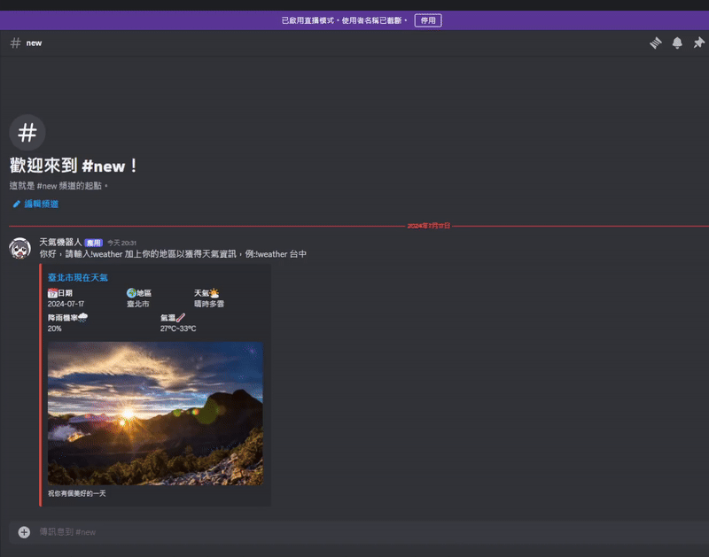

# 第九組 － “500 Internal Server Error”

## 目錄

-   [團隊分工](https://github.com/hjolie/weather-group9/tree/develop#團隊分工)
-   [成果展示](https://github.com/hjolie/weather-group9/tree/develop#成果展示)

## 團隊分工

### 前端/組長：黃詩雯

-   Host 專案
-   溝通處理第一個 Github Repo 的 conflicts
-   與後端溝通首頁的資料需求與 API 回傳的資料格式
-   首頁 (index) 的表格輸出、CSS 樣式處理、JavaScript、RWD 設計與處理

### 前端/報告：曾憶珺

-   成果報告
-   與後端溝通分頁的資料需求與 API 回傳的資料格式
-   分頁(/county) 的版塊與表格輸出、下拉式表單搜尋功能、CSS 樣式處理、JavaScript、RWD 設計與處理
-   Header 和 Footer 的設計、CSS 樣式處理

### 後端：莫翔宇

-   與前端溝通首頁的資料需求與 API 回傳的資料格式
-   以 FastAPI 建置首頁的後端，提供回傳前端全台縣市天氣預報之資料的 API

### 後端：劉晏儒

-   協助重開和重新定義第二個 Github Repo 的檔案結構、Merge PR
-   與前端溝通分頁的資料需求與 API 回傳的資料格式
-   以 FastAPI 建置分頁的後端，提供回傳前端單一縣市天氣預報之資料的 API
-   Docker 打包與網站部署

## 成果展示

### 網站連結：[第九組－全臺一週天氣預報＋各縣市一週天氣預報](http://54.168.41.128:8001/)

-   設計一：首頁的大張表格輸出呈現全臺接下來一週的天氣預報
    -   天氣預報資料包含：一週日期＋星期、全台縣市名稱、白天＋晚上、最低溫～最高溫、天氣狀態小圖示
        
    -   點選每個縣市的名稱或＋ icon，可以進到分頁查看該縣市的天氣詳情
        
-   設計二：分頁的大版塊＋表格輸出呈現單一縣市接下來一週的天氣預報
    -   天氣預報資料包含：一週日期＋星期、單一縣市名稱、白天＋晚上、最低溫～最高溫、天氣狀態小圖示、體感溫度、紫外線小圖示
        
    -   透過下拉式選單選擇縣市名稱，可搜尋並切換至該縣市查看天氣詳情
        
### Discord Bot
-   設計一: 當 Bot 進入聊天室時，會提醒用戶如何輸入指令，並預設顯示台北市的天氣預報，包括氣溫、降雨機率和天氣狀況。
    
-   設計二: 用戶可以輸入指令 !weather [縣市名]，例如 !weather 新北市，Bot 會回傳該地區的天氣預報。
    -   支援輸入縣市全名，例如：台南市、新竹市、新竹縣等，亦可輸入地名，例如：台南。
    -   若輸入新竹和嘉義等縣市名相同的地區，會優先輸出該市的天氣預報。

    